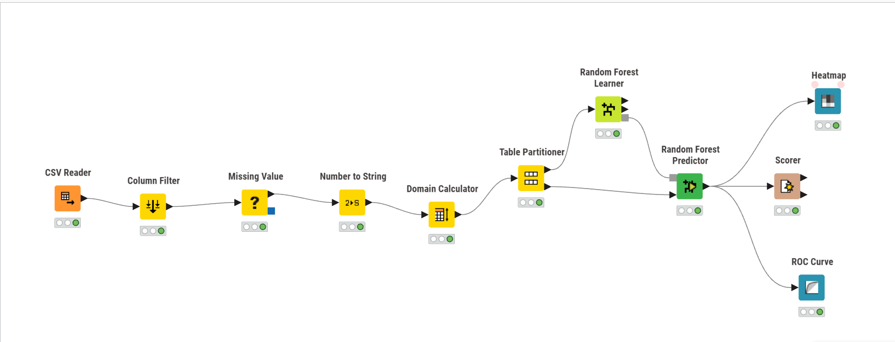
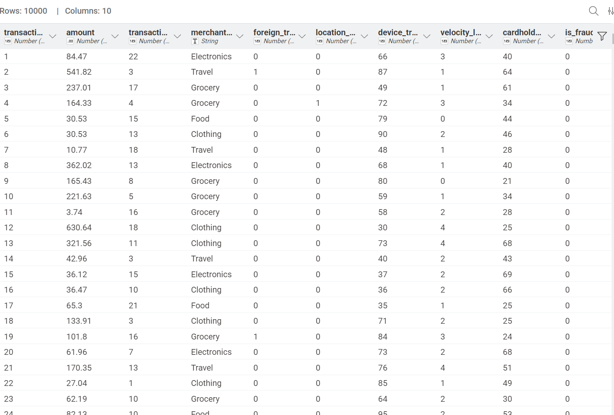
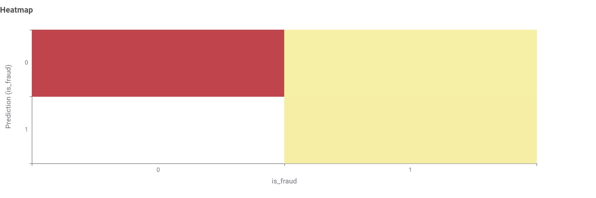
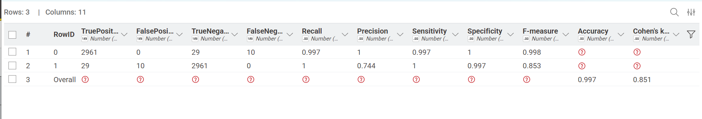
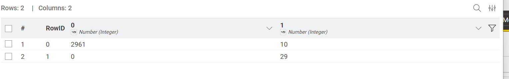
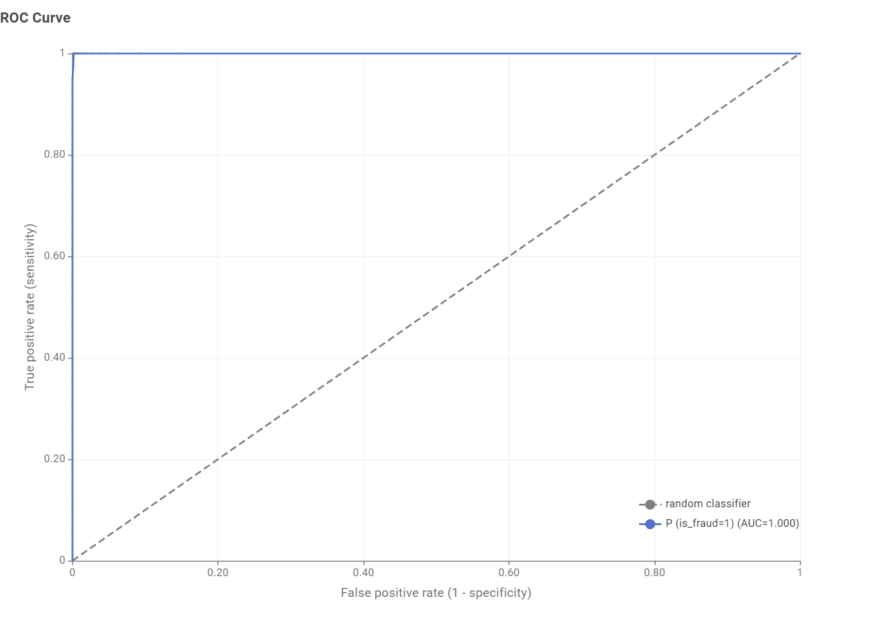

# Credit Card Fraud Detection using KNIME

## 📌 Project Overview
This project presents a complete **machine learning workflow** for detecting fraudulent credit card transactions using the **KNIME Analytics Platform**. The workflow covers data preprocessing, model training, prediction, and evaluation.  

The dataset used in this project is a **custom collection of 10,000 transactions with 10 attributes**, designed to reflect realistic transaction features such as merchant type, transaction amount, device trust, and cardholder age. This ensures interpretability and practical relevance compared to anonymized datasets.

---

## 📂 Dataset
The dataset includes the following attributes:

| Column              | Description |
|---------------------|-------------|
| transaction_id      | Unique identifier for each transaction |
| amount              | Transaction amount |
| transaction_type    | Encoded type of transaction (e.g., purchase, withdrawal) |
| merchant            | Merchant category (Electronics, Travel, Grocery, etc.) |
| foreign_transaction | Flag indicating if transaction is international |
| location_match      | Whether cardholder and merchant locations match |
| device_trusted      | Flag for whether the device is recognized/trusted |
| velocity_limit      | Transaction velocity check (frequency/limit breaches) |
| cardholder_age      | Age of the cardholder |
| is_fraud            | Target variable (0 = genuine, 1 = fraud) |

---

## ⚙️ Workflow in KNIME
The workflow consists of the following steps:

1. **CSV Reader** – Load dataset  
2. **Column Filter** – Select relevant attributes  
3. **Missing Value** – Handle missing data  
4. **Number to String** – Convert numerical values where needed  
5. **Domain Calculator** – Define domain values for categorical features  
6. **Table Partitioner** – Split data into training and testing sets  
7. **Random Forest Learner** – Train the fraud detection model  
8. **Random Forest Predictor** – Apply the model to test data  
9. **Heatmap** – Visualize prediction results  
10. **Scorer** – Evaluate model accuracy, precision, recall, F1-score  
11. **ROC Curve** – Assess model performance with AUC  

---

## 💻 Technology Used
- **KNIME Analytics Platform** – Workflow design and execution  
- **Random Forest Algorithm** – Model training and prediction  
- **Visualization Tools in KNIME** – Heatmap and ROC curve for performance analysis  
- **Custom Transaction Dataset** – 10,000 rows, 10 attributes  

---

## 📊 Model Performance
- **Algorithm Used:** Random Forest  
- **Evaluation Metrics:** Accuracy, Precision, Recall, F1-score, ROC-AUC  
- **Visualization:** Heatmap of predictions, ROC curve  

---

## 📊 Results & Screenshots

The Random Forest model achieved strong performance on the fraud detection dataset:

- **Accuracy:** 99.7%
- **Precision (Fraud class):** 74.4%
- **Recall (Fraud class):** 100%
- **F1-score (Fraud class):** 85.3%
- **Cohen’s Kappa:** 0.851 (indicates strong agreement beyond chance)

### Workflow

### Dataset Preview

### Heatmap (Predictions)

### Accuracy Statistics

### Confusion Matrix

### ROC Curve

---

## 🚀 Key Highlights
- Realistic dataset with interpretable features.  
- End-to-end fraud detection pipeline in KNIME.  
- Clear visualization of model performance.  
- Practical attributes like merchant type, device trust, and velocity checks make the project **industry-relevant**.  

---

## 📌 Future Improvements
- Experiment with other algorithms (XGBoost, Neural Networks).  
- Implement feature engineering (e.g., transaction time patterns).  
- Deploy workflow as a real-time fraud detection service.  

---

## 🧑‍💻 Author
**Nagaraj Lakshman Naik**  
Passionate about creating practical projects that combine software and data.  
Interested in building scalable systems, exploring intelligent applications, and presenting work with clear, professional documentation.

---
